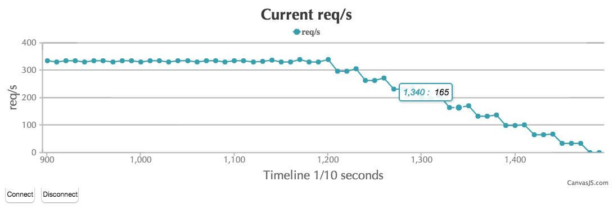

# gotling

Simple golang-based load test application using YAML documents as specification.

For a more full-blown explanation of what Gotling is about, see my blog post here: http://callistaenterprise.se/blogg/teknik/2015/11/22/gotling/

### Recent updates
- UPDATE 2020-04-08: [Leon Stigter](https://github.com/retgits) fixed the JSONPath problem
- UPDATE 2019-04-04: I've updated gotling to use Go modules and changed the project structure to follow [https://github.com/golang-standards/project-layout](https://github.com/golang-standards/project-layout) better**

### Disclaimer
Please note that this was my very first golang program back in 2015 and it's still (2020) probably full of anti-patterns and other nasty stuff. I'm not actively developing Gotling but I'll happily accept sensible PRs!

## What it does
- Provides high-throughput load testing of HTTP services
    - Supports GET, POST, PUT and DELETE
    - Live metrics using HTML5 canvas from canvasjs
    - Request URLs and bodies can contain ${paramName} parameters
    - ${paramName} values can be extracted from HTTP response bodies and bound to a User context
    - Capturing Set-Cookie response headers
    - POST data can be inlined or read from template files
- TCP/UDP sockets
    - Can send line-terminated text strings
    - Possible to use ${varname} variables in payload
    - Does not currently support body parsing or variable extraction from data incoming on the TCP/UDP socket.

## Building
Requires Go 1.11 or later to be installed on your computer.

### NEW: Build using Go Modules

As per 2019-04-03 gotling shall be built using Go modules and there's a Makefile to help out.

#### 1. Clone the source from github
    
    git clone https://github.com/eriklupander/gotling.git
    
#### 2. Build using Make
    
    cd gotling
    make build
    
#### 3. Building for other OS's

    make release
    
Check the dist/ folder for binaries for OS X, Linux and Window (AMD64)

Note! You still need the samples, data and log folders in the same root directory as your gotling binary when running.

#### 4. Running
If you built gotling using _make build_, you'll find your binary in the bin/ folder. Try running the sample "xmldemo":

    > ./bin/gotling samples/xmldemo.yml

## Usage
Define your test setup in a .yml file

    ---
    iterations: 10          # Number of iterations per user
    users: 10               # Number of users
    rampup: 20              # seconds
    actions:                # List of actions. Currently supports http, tcp, udp, sleep
      - http:
          method: GET                                  # GET, POST, PUT, DELETE
          url: http://localhost:8183/courses           # URL. Can include ${paramName} parameters
          accept: json                                 # Only 'json' is currently supported
          response:                                    # Defines response handling
            jsonpath: $[*].id+                         # JsonPath expression to capture data from JSON response
            variable: courseId                         # Parameter name for captured value
            index: first                               # If > 1 results found - which result to store in 'variable': 
                                                       # first, random, last
      - sleep:
          duration: 3                                  # Sleep duration in seconds. Will block current user
      - http:
          method: GET
          url: http://localhost:8183/courses/${courseId}
          accept: json
          response:
            jsonpath: $.author+
            variable: author
            index: first
      - sleep:
            duration: 3
      - tcp:
            address: 127.0.0.1:8081                     # TCP socket connection
            payload: |TYPE|1|${UID}|${email}            # Sample data using parameter substitution

### HTTP POST bodies
Gotling supports POST/PUT bodies either directly inlined in the YAML specification, or read from a template file:

#### Inlined

    - http:
        title: Some title
        method: POST
        url: http://localhost:9183/mypath
        body: '{"id":100,"name":"Some name","author":"${author}-${someId}","created":"2015-10-23T21:33:38.254+02:00","baseLatitude":45.634353,"baseLongitude":11.3424324}'
        accept: application/json

Note that we use _body_ in the inlined example

#### From template

    - http:
        title: Submit query
        method: POST
        url: http://localhost:8080/myxmlservice
        template: myproject/MyFancySOAPRequest.xml
        accept: application/xml

In this example, we use _template_ instead of _body_. The _myproject/_ folder should always be placed in the /templates directory in the root of the project. Note that ${varName} variable substitution from feeders (see below) or values captured from previous responses in the action sequence can be used in template files.  

### Feeders and user context
Gotling currently support CSV feeds of data. First line needs to be comma-separated headers with the following lines containing data, e.g:

    id,name,size
    1,Bear,Large
    2,Cat,Small
    3,Deer,Medium
    
These values can be accessed through ${varname} matching the column header.

#### The UID
Each "user" gets a unique "UID" assigned to it, typically an integer from 10000 + random(no of users). Perhaps I can tweak this to either use UUID's or configurable intervals. Anyway, the UID can be used using ${UID} and can be useful for grouping data etc.

### Capturing cookies
It's quite common that you need to load-test a secured API. Gotling provides a mechanism that allows you to capture Set-Cookie response headers which then will be automatically applied to subsequent HTTP actions for the current user.

Here is an example where a form-based login POST is used for logging in and storing the returned JSESSIONID cookie

    - http:
      title: Login
      method: POST
      url: https://some.host.name/login
      body: 'put your urlencoded form data here'
      accept: '*/*'
      contentType: application/x-www-form-urlencoded
      storeCookie: JSESSIONID

### Variable capture from HTTP response bodies
It's possible to use jsonpath OR xmlpath to capture variables from HTTP responses (json or xml) and use in subsequent invocations during the ongoing sequence of actions. See ${courseId} in the sample above.

A similar sample for xmlpath:

    - http:
              method: GET
              url: http://www.w3schools.com/xml/cd_catalog.xml
              accept: text/xml
              response:
                xmlpath: //title
                variable: myTitleVar
                index: random
    - http:
              method: GET
              url: http://some.other.service.maybe/authors/${myTitleVar}
              accept: json
                    
Please note that a response definition only may contain either a jsonpath OR an xmlpath. You can't have both.

For more on xmlpath, see   [xmlpath](https://godoc.org/gopkg.in/xmlpath.v2)

##### Important note: xmlpath for Go does not support xml namespaces!

### HTTPS support
Gotling currently supports HTTPS, including hosts using self-signed certificates.

In the future, we'll probably add an option to allow/disallow unsecure https.

## Realtime dashboard
Access at http://localhost:8182

Click "connect" to connect to the currently executing test.

## HTML reports
Not functional right now :(

## Uses the following libraries
- github.com/davecheney/profile
- gopkg.in/yaml.v2
- gopkg.in/xmlpath.v2
- gorilla/websocket
- highcharts

## License
Licensed under the MIT license.

See LICENSE
